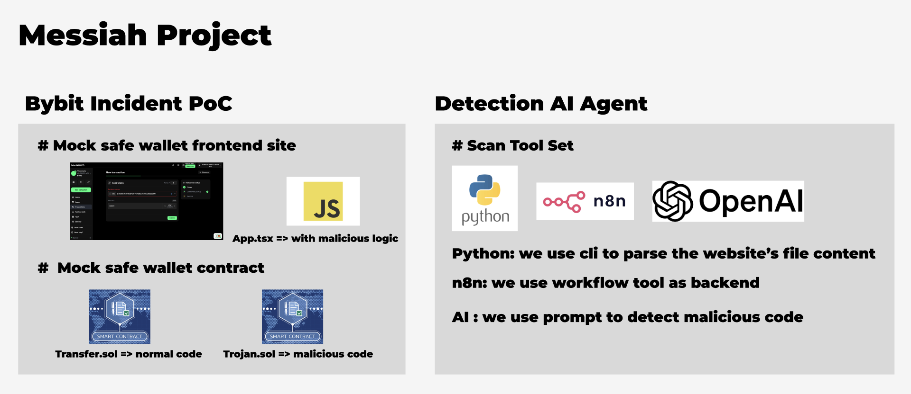
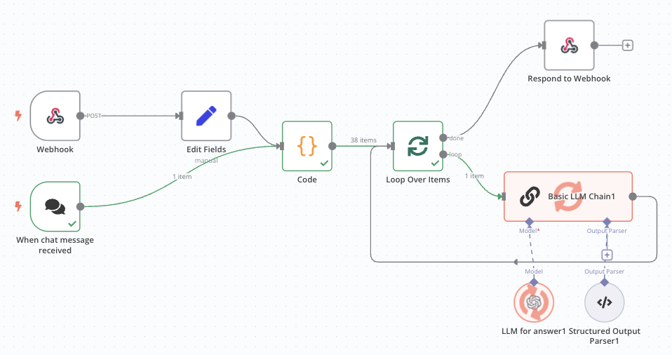
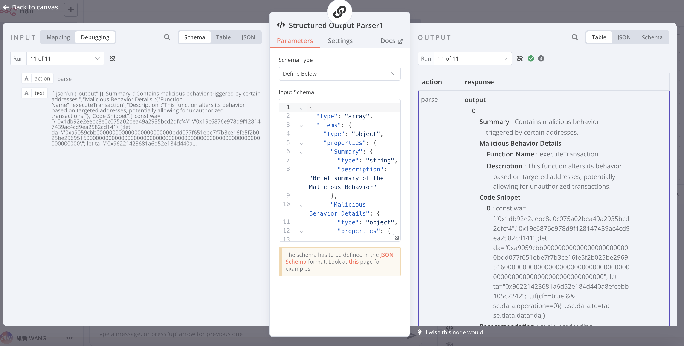

# Messiah

prevent next 1.5B hack



## Incident Report

| File                                                                                      | Lost |
| ----------------------------------------------------------------------------------------- | ---- |
| [Bybit Hack Report](./incident/Bybit/Bybit-Incident-Investigation-Preliminary-Report.pdf) | 1.5B |

## How to reproduce bybit hack detection

1. open n8n locally
2. import `n8n_workflow/scan_js.json` into n8n
3. visit n8n dashboard `http://localhost:5678`
4. copy the real malicious js file content `incidnet/Bybit/_app-52c9031bfa03da47.js`
5. paste to chatbox and execute it
6. check the result under the structured output component in workflow




## Frontend Setup

```bash
pnpm install
pnpm dev
```

you can use github action deploy to github page

Github Page:
https://daky.github.io/Messiah/

reference:
https://vite.dev/guide/static-deploy

note: since we use pnpm, so need to npm install it

## n8n & Backend Installation Setup

1. Setup Python environment:

```bash
# Initialize virtual environment and install dependencies
pyenv virtualenv 3.11 Messiah
pyenv activate Messiah
poetry shell
poetry install
```

2. Configure environment variables in `.env`:

```bash
cp .env.example .env
```

Update the environment variables in `.env` file if needed.

3. Start n8n and database:

```bash
source .env
docker-compose up -d
```

4. Access the n8n dashboard, Open your browser and navigate to `http://localhost:5678`

5. (First time only) Setup owner account, activate free n8n pro features

## Cli:

How to download target website all JS files

```bash
poetry run python cli/main.py scan
```

## Tech Stack:

- React
- Tailwind CSS
- TypeScript
- Vite
- Web3 Onboard
- ethers.js v6
- Python
- n8n

## Chain and Faucet Setup

### HashKey Chain Testnet

add to wallet: https://chainlist.org/chain/133

faucet: https://faucet.hsk.xyz/zh_TW/faucet

### Celo Alfajores Testnet

add to wallet: https://chainlist.org/chain/44787

faucet: https://faucet.celo.org/alfajores

### Zircuit Garfield Testnet

add to wallet: https://chainlist.org/chain/48898

faucet: https://docs.zircuit.com/garfield-testnet/quick-start#deposit-eth-from-sepolia-to-zircuit-l1-greater-than-l2
get sepolia ETH first and then use https://bridge.garfield-testnet.zircuit.com/ to bridge it to Zircuit testnet

## Contract Deployment Setup

use [Remix](https://remix.ethereum.org/) to deploy

1.Paste the contract into the editor and keep it open.

2.Then go to the sidebar, select "Solidity compiler," and click "Compile."

3.Next, go to "Deploy & run transactions." At the top under "Environment," select "WalletConnect" to connect to your Browser Wallet. Then switch to the chain you want to deploy on, make sure the correct contract is selected for deployment, and click "Deploy." A wallet confirmation for the transaction will pop up, and that’s it.

## Contract Deployment Result

### HashKey Chain Testnet

Trojan.sol

**address:** 0x426D91Fe0235daCE15Ea3764944d925d2B600Fa3

**tx:** https://hashkeychain-testnet-explorer.alt.technology/tx/0x87becfe68748f0fd4485217b61178c7c1f47143d220599ee6eec110b17106d55

Transfer.sol

**address:** 0xbdd77c95a14f798a06b99773a7859102fcab8009

**tx:** https://hashkeychain-testnet-explorer.alt.technology/tx/0x43babad31cfc82bbc0098462e3b412cc82fb9479f76f8d4ae66115b7a9aed4eb

### Celo Alfajores Testnet

Trojan.sol

**address:** 0x426D91Fe0235daCE15Ea3764944d925d2B600Fa3

**tx:** https://celo-alfajores.blockscout.com/tx/0xecf78f4b601220781d83aa3856a05cfc6938b23beac0c5129e839a385c6d014b

Transfer.sol

**address:** 0xBDD77C95A14f798A06b99773a7859102FcAb8009

**tx:** https://celo-alfajores.blockscout.com/tx/0x197b8b31653e92ff7e134a326c855d47d96e9cb7223bc885bc7a5cac4c69c6a9

### Zircuit Garfield Testnet

Trojan.sol

**address:**

0x426D91Fe0235daCE15Ea3764944d925d2B600Fa3

**tx:** https://explorer.garfield-testnet.zircuit.com/tx/0x6f6a802ad45819b7a11ab49e317aa1d1653cbf22df8323896bd1b21a8b7838c3

Transfer.sol

**address:** 0xBDD77C95A14f798A06b99773a7859102FcAb8009

**tx:** https://explorer.garfield-testnet.zircuit.com/tx/0xef710ed662eb86d6a563aa17ee72e2a0c44c8ce15d1700792595612ac5eca708
